# 🏛️ MonuTell – AI-Powered Interactive Audio Guide

> **Live Demo:** [https://www.monutell.app/](https://www.monutell.app/)  
> _Note: This is a Progressive Web App (PWA) designed for travelers. For the best experience, open on a mobile device._

---

## 📖 The Problem: "Screen Fatigue" in Travel

Modern tourism has a paradox: We travel to see the world, but we spend most of our time staring at screens reading Wikipedia articles or following maps.

**MonuTell** solves this by providing an "eyes-up" experience. It uses **Geolocation** to detect landmarks in Budapest and narrates their stories via high-quality AI-generated audio, allowing users to immerse themselves in the environment while walking.

---

## 📸 Project Showcase

### 📱 The User Experience (Mobile PWA)

The app is designed with a "Mobile First" approach, featuring a clean interactive map and an audio player that syncs with the user's walk.

_Features: Real-time GPS tracking, Interactive Leaflet Map, Azure Neural TTS Audio._

### 🛠️ The "Kitchen": Admin & Automation

Behind the scenes, the system is powered by a custom Admin Dashboard and an AI Content Pipeline.

|                       Admin Dashboard (Crowdsourcing)                        |                            Internal CLI Tool (Automation)                            |
| :--------------------------------------------------------------------------: | :----------------------------------------------------------------------------------: |
|    |               |
| **Management:** Secure dashboard to approve or reject user-submitted places. | **Pipeline:** Custom Node.js CLI script that generates content using Gemini & Azure. |

---

## 🏗️ System Architecture

This project operates on a "Headless" content generation model. The content is pre-generated via a custom **Node.js Automation Engine** ([`scripts/architect-engine.js`](./scripts/architect-engine.js)) and served via a serverless React app.

```mermaid
graph TD
    subgraph Automation_Pipeline [Phase 1: Content Factory]
        Node(🚀 Architect Engine) -->|1. Prompt| Gemini(✨ Google Gemini)
        Gemini -->|2. Story Text| Azure(🗣️ Azure Neural TTS)
        Azure -->|3. Audio File| Blob(☁️ Vercel Blob)
        Node -->|4. Save Content & Links| DB[(🛢️ Neon Postgres)]
    end

    subgraph User_App [Phase 2: React Client]
        Client(📱 React 19 PWA) <-->|5. Fetch Data| API(⚡ Vercel Functions)
        API <-->|Query| DB
        Client <-->|6. Stream Audio| Blob
    end
```

