# 🏛️ MonuTell – AI-Powered Interactive Audio Guide

> **Live Demo:** [https://monutell.vercel.app](https://monutell.vercel.app)  
> _Note: Designed as a Mobile PWA. For the best experience, open on a mobile device._

---

## 📖 The Problem: "Screen Fatigue" in Travel

Modern tourism has a paradox: We travel to see the world, but we spend most of our time staring at screens reading Wikipedia articles or following maps.

**MonuTell** solves this by providing an "eyes-up" experience. It uses Geolocation to detect landmarks in Budapest and narrates their stories via high-quality AI-generated audio, allowing users to immerse themselves in the environment.

---

## 📸 Screenshots & Features

### 📱 The Mobile Experience

|                             Interactive Map & Audio Player                             |                            Real-Time "Karaoke" Sync                            |
| :------------------------------------------------------------------------------------: | :----------------------------------------------------------------------------: |
|                                 |                             |
| **Interactive Map:** Built with Leaflet & React 19. Tracks user location in real-time. | **Audio Sync:** Custom logic highlights text as the audio plays (0ms latency). |

### 🛠️ The "Kitchen": Admin & Content Pipeline

|                                  Admin Dashboard                                   |                             Terminal Automation Tool                              |
| :--------------------------------------------------------------------------------: | :-------------------------------------------------------------------------------: |
|                               |                          |
| **Crowdsourcing:** Users suggest places, Admins approve/reject via this dashboard. | **Automation:** My custom Node.js CLI generates content using Gemini & Azure TTS. |

---

## 🏗️ System Architecture

This project is not just a UI; it's a full-stack system with a custom automated content pipeline.

```mermaid
graph TD
    subgraph Automation_Pipeline [Phase 1: Content Factory]
        Node(🚀 Node.js CLI) -->|1. Prompt| Gemini(✨ Google Gemini)
        Gemini -->|2. Story Text| Azure(🗣️ Azure Neural TTS)
        Azure -->|3. Audio File| Blob(☁️ Vercel Blob)
        Node -->|4. Save Data & Links| DB[(🛢️ Neon Postgres)]
    end

    subgraph User_App [Phase 2: React Client]
        Client(📱 React 19 PWA) <-->|5. Fetch Data| API(⚡ Vercel Functions)
        API <-->|Query| DB
        Client <-->|6. Stream Audio| Blob
    end
```

